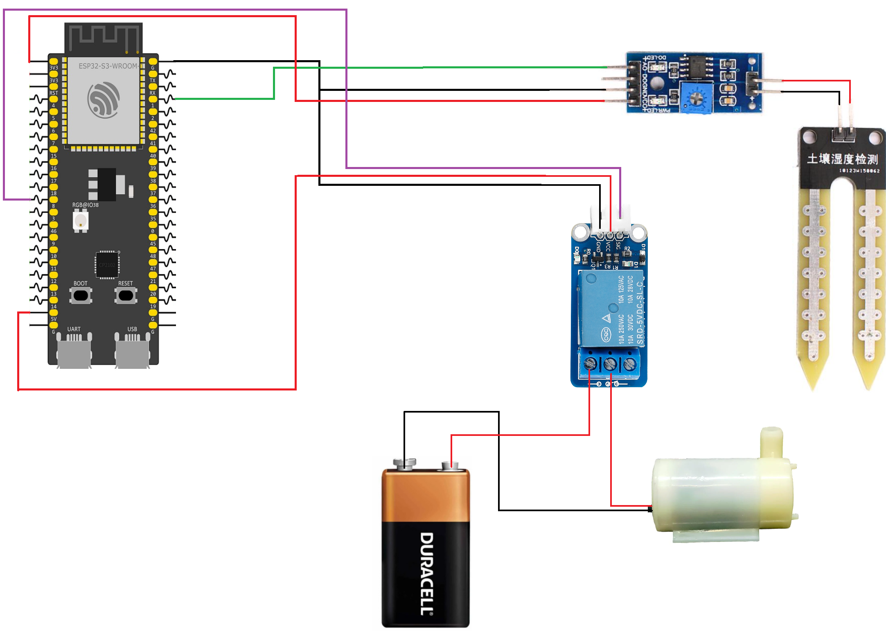

# ESP32 Automatic Plant Watering System

This example demonstrates how to use a soil moisture sensor and a relay-controlled water pump to create an automatic plant watering system. The ESP32-S3 continuously monitors the soil moisture level and activates the pump when the soil becomes dry.

