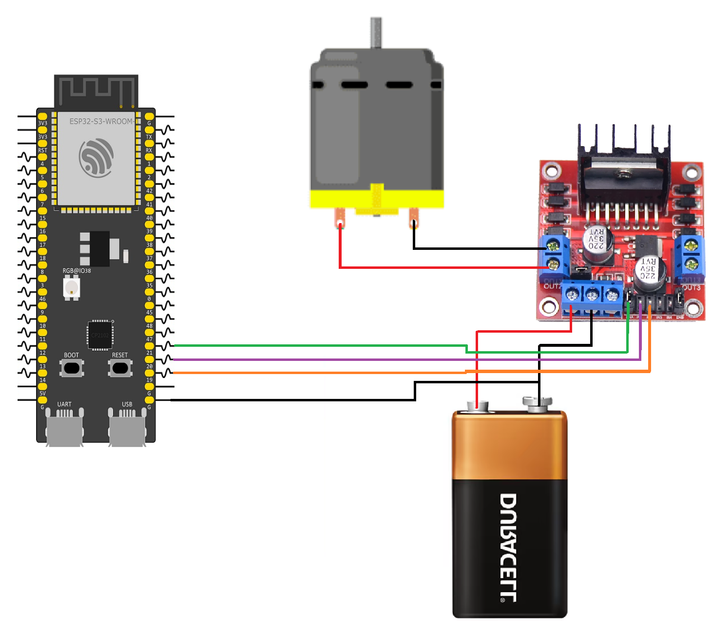

# ESP32 DC Motor Control with L298N Driver

This example demonstrates how to control the speed and direction of a DC motor using an L298N motor driver. The ESP32-S3 uses two GPIO pins to control the motor direction and a PWM signal to control the motor speed.

