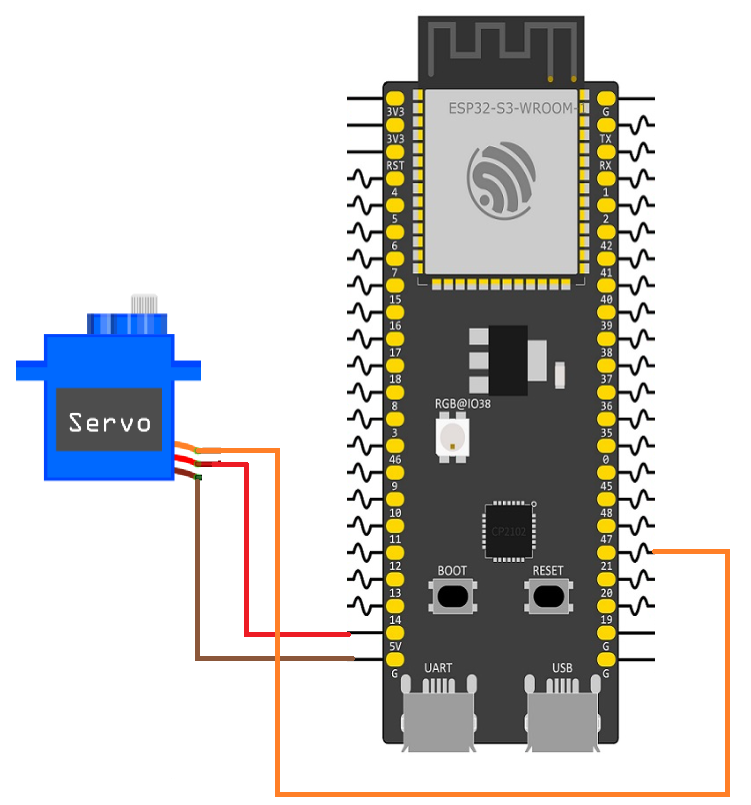

# ESP32 Servo Motor Control

This example demonstrates how to control a servo motor using the ESP32-S3 LEDC PWM peripheral. The servo alternates between two positions, approximately +90° and −90°, holding each position for one second before moving to the other.

