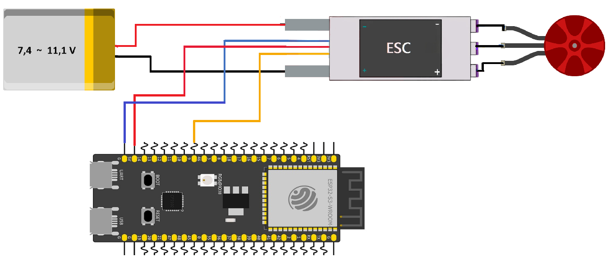

# ESP32 Brushless DC Motor (BLDC) Control with ESC

This example demonstrates how to control a brushless DC (BLDC) motor using an Electronic Speed Controller (ESC). The ESP32-S3 generates a 50 Hz PWM signal that controls the motor throttle through the ESC. After performing the required ESC arming sequence, the motor alternates between 50% throttle and a stopped state.

