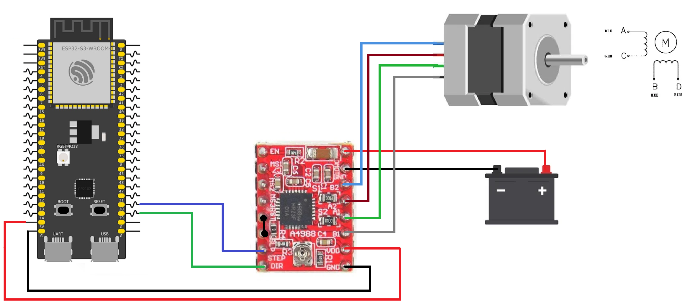

# ESP32 Stepper Motor Control with A4988 Driver

This example demonstrates how to control a stepper motor using an A4988 driver. The ESP32-S3 uses one GPIO pin to select the rotation direction and another GPIO pin to generate step pulses. The motor rotates 100 steps in one direction, waits for 3 seconds, then rotates 100 steps in the opposite direction before repeating the sequence.

