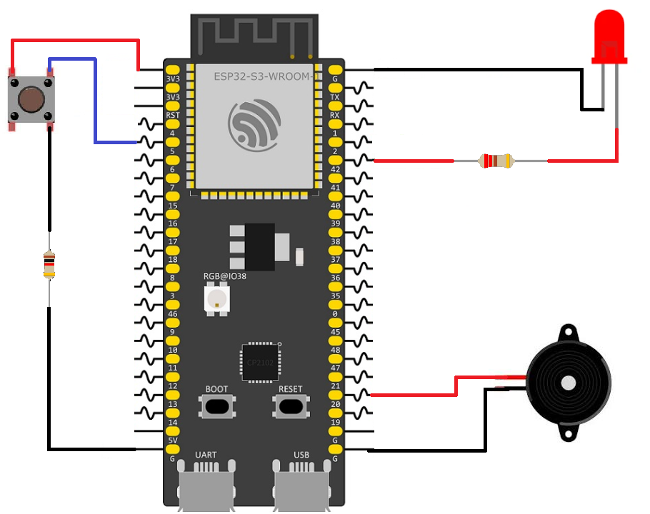

# ESP32 Active Buzzer and LED with Push Button

This example demonstrates how to use an active buzzer and an LED with a push button. When the button is pressed, the buzzer produces sound and the LED blinks continuously. Releasing the button turns the buzzer off and stops the LED blinking.

