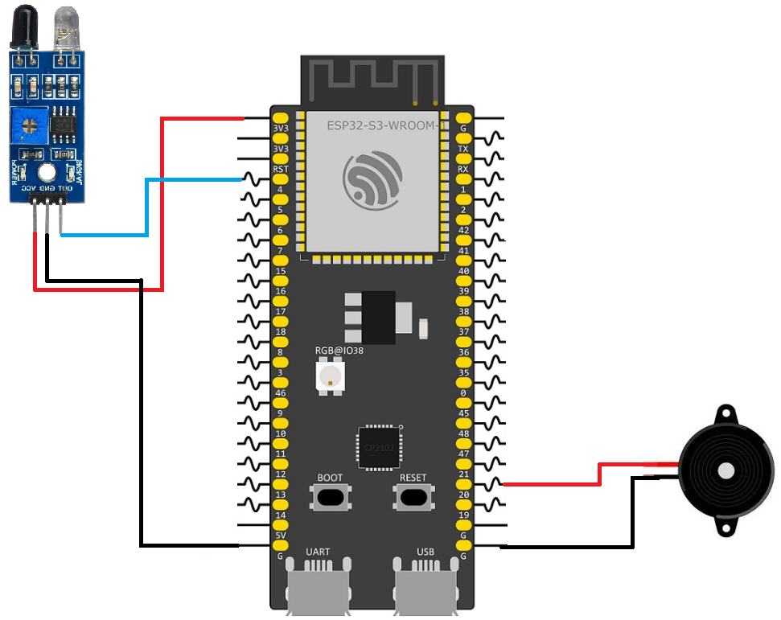

# ESP32 Obstacle Sensor and Buzzer

This example demonstrates how to use an obstacle sensor with an active buzzer. When the obstacle sensor detects an object, the buzzer is activated. When no obstacle is detected, the buzzer remains off.

