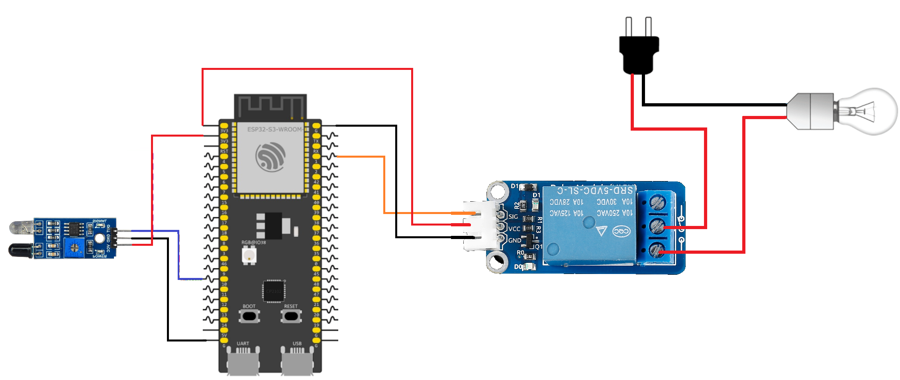

# ESP32 Relay Controlled by an Obstacle Sensor

This example demonstrates how to use an obstacle sensor to control a relay. Each time the obstacle sensor detects an object, the relay state toggles between ON and OFF, allowing a connected device such as a lamp to be switched on and off.

