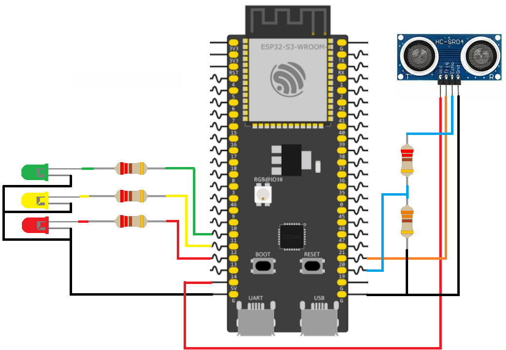

# ESP32 Ultrasonic Sensor Distance Indicator

This example demonstrates how to use an HC-SR04 ultrasonic sensor to measure distance and indicate the result using three LEDs. Depending on the measured distance, the red, yellow, or green LED will turn on.

