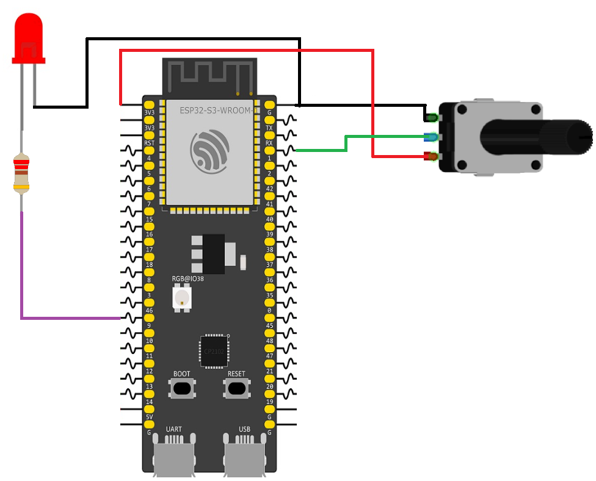

# ESP32 Potentiometer Controlled LED Brightness

This example demonstrates how to use a potentiometer to control the brightness of an LED. The potentiometer value is read using the ESP32-S3 ADC and directly mapped to a PWM duty cycle, allowing smooth brightness adjustment.

