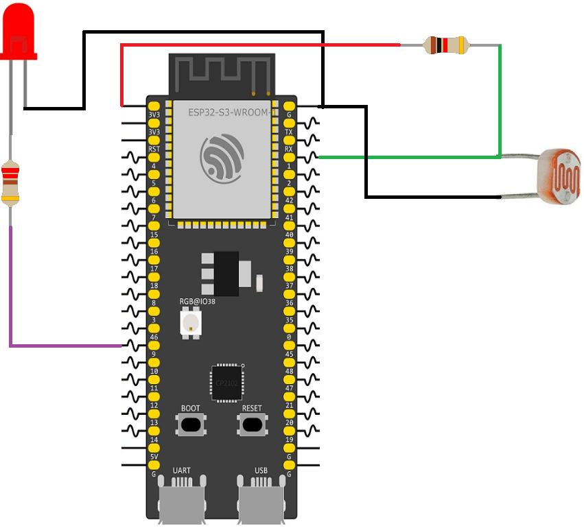

# ESP32 Automatic Night Light with LDR

This example demonstrates how to use a Light Dependent Resistor (LDR) to create an automatic night light. The ESP32-S3 continuously reads the light level using the ADC and turns an LED on or off depending on the measured brightness.

