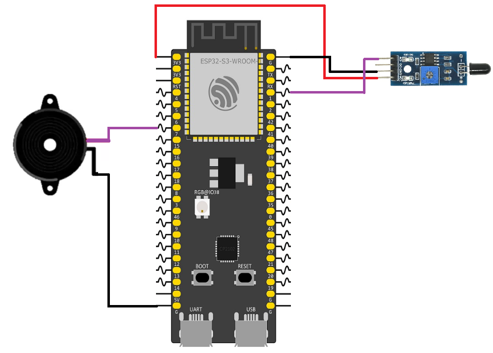

# ESP32 Flame Detection Alarm

This example demonstrates how to use a flame sensor with an active buzzer to create a simple fire alarm. The ESP32-S3 continuously reads the analog output of the flame sensor and activates the buzzer when a flame is detected.

