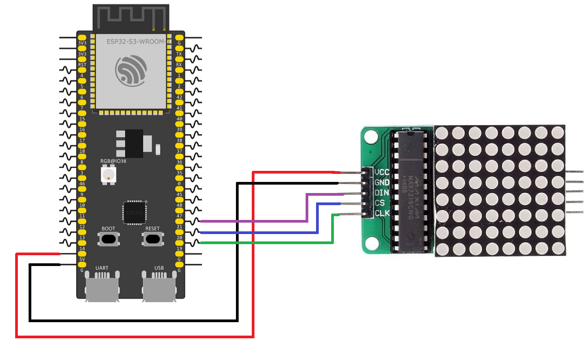

# ESP32 LED Matrix Heart Animation with MAX7219

This example demonstrates how to control an 8×8 LED matrix using a MAX7219 driver. The ESP32-S3 communicates with the MAX7219 through three digital pins (DIN, CLK, and CS), while the driver handles all multiplexing internally. The program displays a heart pattern on the LED matrix, waits for a short period, clears the display, and then repeats the sequence to create a blinking heart animation.

