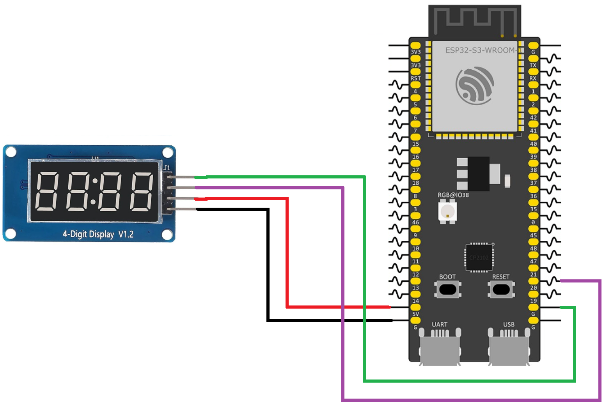

# ESP32 Four-Digit 7-Segment Display with TM1637

This example demonstrates how to control a four-digit 7-segment display using a TM1637 driver module. The ESP32-S3 communicates with the TM1637 through only two digital pins (CLK and DIO), while the driver handles all digit multiplexing and display control internally. The program displays the number 1234 on the four-digit display by sending segment data to the TM1637 over its two-wire serial interface, and continuously refreshes the display to keep the digits visible.

