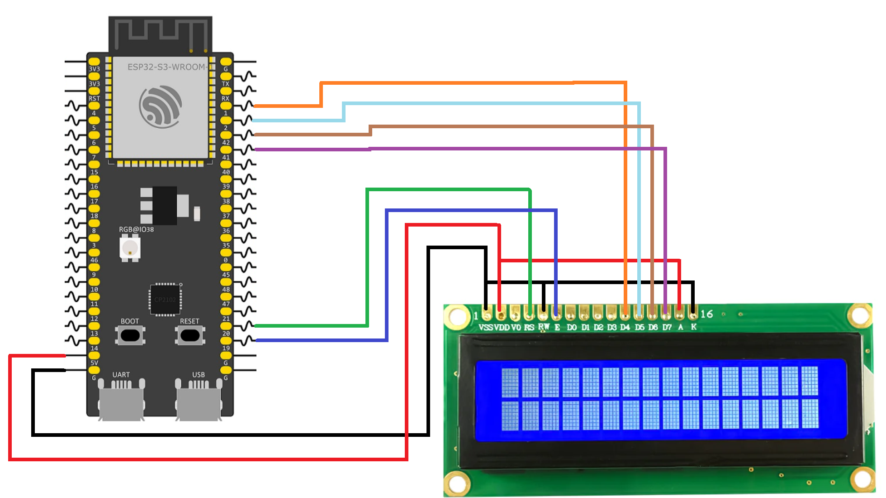

# ESP32 LCD Hello World in 4-Bit Mode

This example demonstrates how to control a 16×2 character LCD using an ESP32-S3 in 4-bit communication mode. Instead of using all eight data lines, the LCD receives data through only four data pins (D4–D7), reducing the number of GPIOs required while still allowing full control of the display.

The project is implemented as a reusable ESP-IDF component that handles LCD initialization, command transmission, cursor positioning, and text output. During startup, the LCD is configured for 4-bit operation following the initialization sequence specified in the controller datasheet. Once initialized, the program displays the message "Hello World" on the first line of the LCD.

By separating the LCD driver into its own component, the display functions can be easily reused in future projects that require menus, status messages, sensor readings, or other text-based user interfaces.

