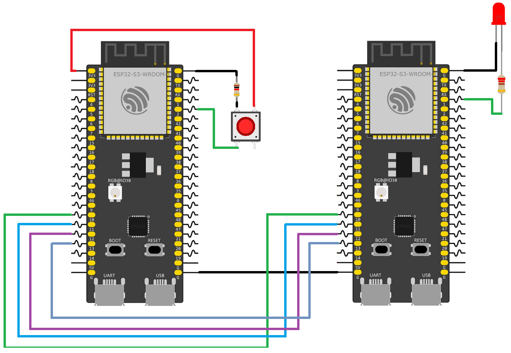

# ESP32-to-ESP32 SPI Communication

This example demonstrates how to establish high-speed communication between two ESP32-S3 boards using the SPI protocol. One ESP32-S3 is configured as the SPI master, while the second ESP32-S3 operates as the SPI slave. 

A push button is connected to the master ESP32-S3, and an LED is connected to the slave ESP32-S3. When the button is pressed, the master toggles an internal state and sends either the message "ON" or "OFF" over the SPI bus. The slave continuously listens for incoming SPI transactions and updates the LED state accordingly. Receiving "ON" turns the LED on, while receiving "OFF" turns it off.

The SPI bus is built using four shared communication lines: MOSI, MISO, SCLK, and CS. In this setup, GPIO 11 is used for MOSI, GPIO 12 for MISO, GPIO 13 for SCLK, and GPIO 10 for chip select. Both ESP32-S3 boards share these lines, and communication is synchronized using the SPI clock generated by the master.

On the master side, the SPI bus is initialized using the ESP-IDF SPI master driver, and a device configuration is added with a defined clock speed of 1 MHz. Data is sent using SPI transactions, where messages are packaged into a buffer and transmitted using spi_device_transmit(). On the slave side, the SPI slave driver waits passively for transactions using spi_slave_transmit(), then processes the received buffer to determine the LED state.

This project demonstrates the complete SPI workflow, including bus configuration, device setup, transaction handling, full-duplex communication, and using high-speed serial data exchange to control external hardware in real time.

