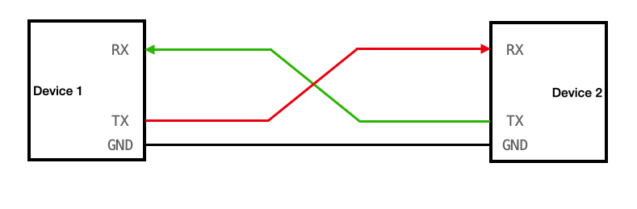
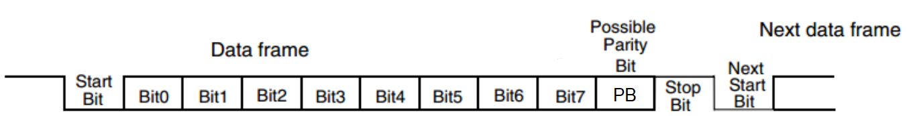
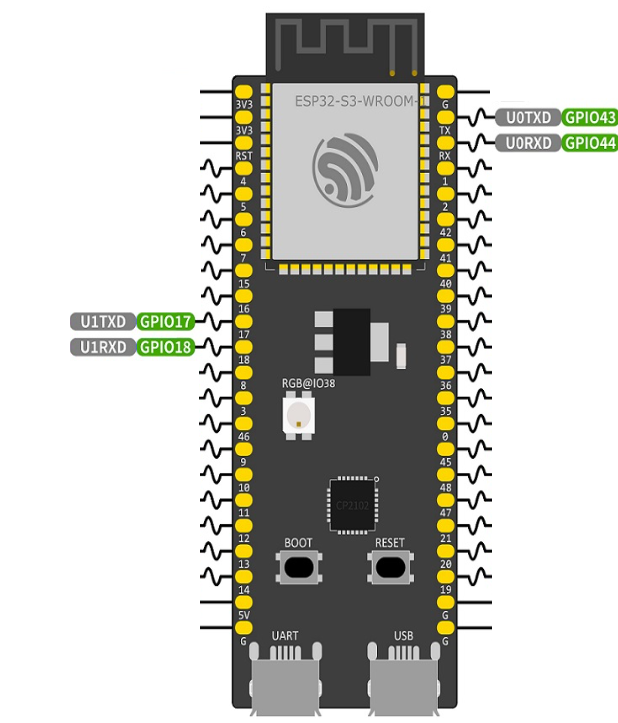
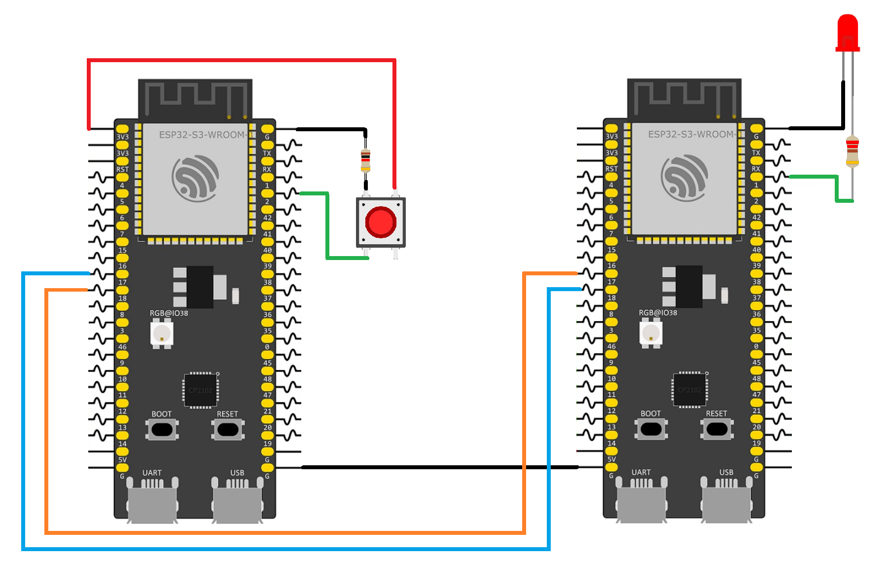
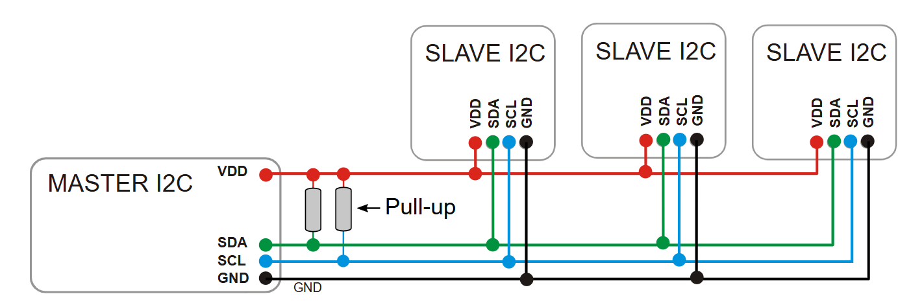
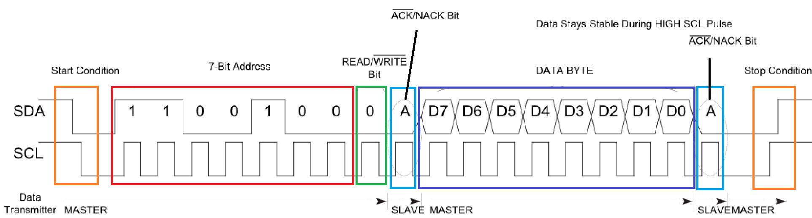
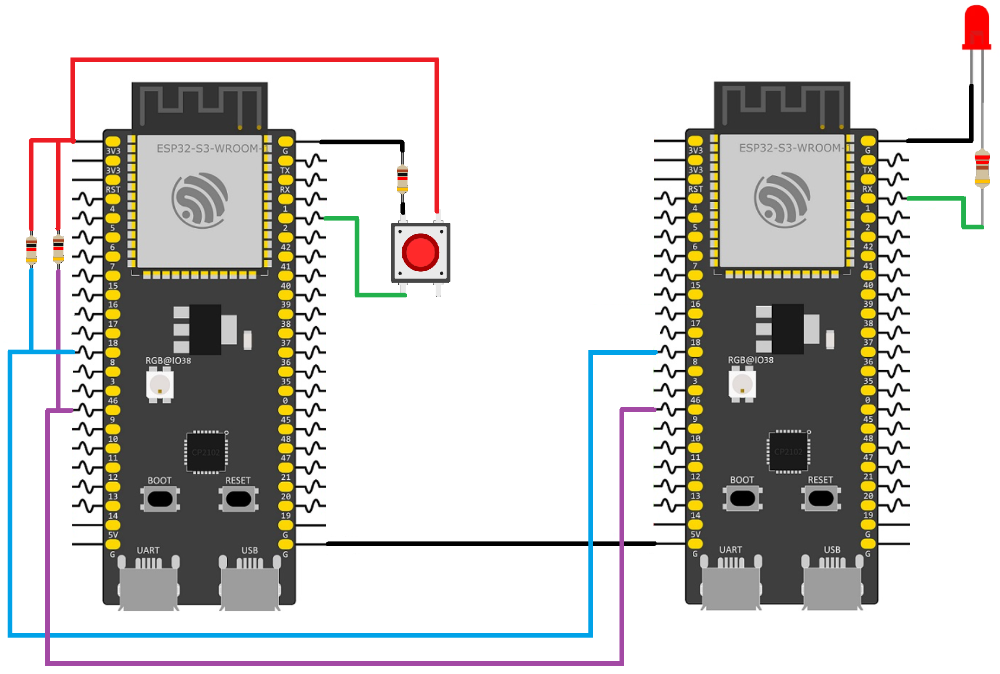

## Objectives
- Exploring Communication Protocols

## Communication Protocols 
When building large embedded system projects, we often need to interface with many external devices such as sensors, displays, memory modules, and actuators. However, the number of available GPIO pins on a microcontroller like the ESP32-S3 can be limited.

To overcome this limitation, communication protocols are used. These protocols enable a microcontroller to communicate with multiple devices efficiently by sending and receiving data over shared communication lines, rather than requiring a dedicated pin for each device. This allows us to control multiple peripherals while minimizing GPIO usage.

Additionally, communication protocols make it possible to connect multiple ESP32 boards together. This expands the overall system capabilities by increasing the number of available I/O pins and distributing tasks across different boards. As a result, systems become more modular, scalable, and capable of handling complex applications.

The ESP32-S3 supports a wide range of communication protocols, including:
- UART (Universal Asynchronous Receiver/Transmitter)
- SPI (Serial Peripheral Interface)
- I²C (Inter-Integrated Circuit)
- I²S / PDM (audio communication protocols)
- USB OTG (On-The-Go)
- TWAI (Two-Wire Automotive Interface, compatible with CAN)
- RMT (Remote Control Peripheral for precise signal generation and reception)


### UART Protocol
UART (Universal Asynchronous Receiver/Transmitter) is one of the most widely used communication protocols in embedded systems. It provides a simple and efficient way to exchange data between devices using serial communication. UART is primarily a point-to-point communication protocol, meaning it is designed to connect exactly two devices directly one acting as the transmitter and the other as the receiver. Unlike bus-based protocols, UART does not support multiple devices sharing the same communication line without additional hardware.

UART communication uses two main pins:
- **TX (Transmit)** sends data from the device
- **RX (Receive)** receives data from another device

The protocol is **asynchronous**, which means it does not require a shared clock signal between devices. Instead, both devices must agree on a common communication speed, known as the **baud rate**. Data is transmitted one bit at a time over the TX line and received on the RX line, typically framed with start and stop bits to ensure proper synchronization.
#### UART Connection
To connect two devices together using UART communication, we link the transmitter (TX) of the first device to the receiver (RX) of the second device. Similarly, the receiver (RX) of the first device is connected to the transmitter (TX) of the second device. In other words, TX connects to RX, and RX connects to TX.  In addition, we link the GND of the two devices so that they use the same voltage reference.



#### UART Working Principle
To work with the UART protocol, we first need to make sure that the two connected devices can understand each other. This is done by configuring four main communication settings:
- **Baud rate**: Represents the communication speed, measured in bits per second (bps). It determines how fast the bits are transmitted. Both devices must use the same baud rate so they can correctly read the timing of the signal.
- **Data bits length**: Defines the number of bits used to represent the actual data in each frame. The most common value is 8 bits, but it can also be 5, 6, 7, or 9 bits depending on the application.
- **Parity bit**: Used for basic error detection. The parity can be:
    - **Even parity**: when we set even parity the party bit will be set to one if total number of 1s in the data becomes is odd.
    - **Odd parity**: when we set odd parity, the party bit will be set to one if total number of 1s in the data becomes is even.
- **Stop bit(s)**: Indicates the end of the data frame. It also gives the receiver time to prepare for the next transmission. Common configurations use 1 or 2 stop bits.

After configuring both devices with the same UART settings, data transmission can begin.

A UART transmission line stays in a HIGH state when idle. To start communication, the transmitter changes the TX line from HIGH to LOW. This is called the start bit, and it signals the beginning of a data frame.

After the start bit, the transmitter sends the data bits one by one while respecting the configured baud rate timing. The bits are usually transmitted starting from the Least Significant Bit (LSB) first.

Next, if parity is enabled, the transmitter sends the parity bit for error checking.

Finally, the transmitter sends the stop bit(s) by setting the TX line back to **HIGH**. This indicates that the transmission of the current data frame has ended.



#### Using UART protocol Esp32 
The ESP32-S3 has three hardware UART interfaces: UART0, UART1, and UART2. By default, the commonly used pin assignments are:
- **UART0** typically used for serial communication, flashing, and debugging
    - **TX:** GPIO 43
    - **RX:** GPIO 44
- **UART1**
    - **TX:** GPIO 17
    - **RX:** GPIO 18




The UART pins on the ESP32-S3 are highly flexible thanks to the GPIO matrix, so they can be remapped to other compatible GPIO pins in software if needed.
#### Programming the UART Interface
Now that we understand the working principle of the UART protocol, let’s build a simple project where we connect two ESP32-S3 boards together using UART communication. In this project, the first ESP32-S3 will have a push button connected to it. When the button is pressed, the board will send either "ON" or "OFF" to the second ESP32-S3 using the UART protocol. The second ESP32-S3 will then read the received data and turn an LED on or off accordingly.

Let’s start by building the circuit. For the UART communication between the two ESP32-S3 boards, we will use GPIO 17 and GPIO 18 as the TX and RX pins. On the first ESP32-S3, GPIO 1 will be used to read the state of the push button, while on the second ESP32-S3, GPIO 1 will be used to control the LED.



After finishing the circuit, we can move on to writing the program for the first ESP32-S3. We begin by importing the libraries that we will need for UART communication. Then, we define the constants for the UART port, TX and RX pins, and the buffer size.
```C 
#include "freertos/FreeRTOS.h"  
#include "freertos/task.h"  
#include "driver/uart.h"  
#include "driver/gpio.h"
#include <stdbool.h>

#define UART_PORT UART_NUM_1  
#define UART_TX_PIN 17  
#define UART_RX_PIN 18  
#define BUF_SIZE 1024  
  
```
Next, inside the `app_main()` function, we configure GPIO 1 as an input pin connected to the push button. We also enable the internal pull-down resistor so that the pin remains in a LOW state when the button is not pressed. This helps prevent floating or noisy signals that could cause incorrect readings. After that, we create a boolean variable called `ledState` and initialize it to `false`. This variable will be used to store the current state that will later be sent to the second ESP32-S3.
```c
void app_main(void) {  
   gpio_set_direction(1, GPIO_MODE_INPUT);
   gpio_set_pull_mode(1,GPIO_PULLDOWN_ONLY);
   bool ledState = false;
```
After configuring the GPIO pin, we now need to configure the UART communication settings. First, we create a `uart_config_t` structure and set the UART parameters such as the baud rate, data bits, parity, and stop bits. In this project, we use a baud rate of 115200, 8 data bits, no parity bit, and 1 stop bit, which is one of the most common UART configurations. We also disable hardware flow control and use the default clock source.
```c
	uart_config_t uart_config = {  
		.baud_rate = 115200,  
		.data_bits = UART_DATA_8_BITS,  
		.parity = UART_PARITY_DISABLE,  
		.stop_bits = UART_STOP_BITS_1,  
		.flow_ctrl = UART_HW_FLOWCTRL_DISABLE,  
		.source_clk = UART_SCLK_DEFAULT,  
	};  
```
Next, we install the UART driver using the `uart_driver_install()` function. This function initializes the UART driver and allocates the required resources for UART communication this function take five parameter.   
The first parameter, `UART_PORT`, specifies which UART peripheral we want to use. Earlier, we defined it as `UART_NUM_1`, meaning that UART1 on the ESP32-S3 will be used for communication.   
The second parameter, `BUF_SIZE`, defines the size of the receive buffer in bytes. In our project, we set it to `1024`, which means the UART driver can store up to 1024 bytes of incoming data before it is processed.   
The third parameter represents the size of the transmit buffer. In this example, we set it to `0`, which disables the dedicated TX buffer because our application is simple and does not require buffered transmission.   
The fourth parameter defines the size of the UART event queue. The UART driver can generate events such as receiving data or detecting errors, and these events can be stored inside a queue. Since we are not using UART events in this project, we set this value to `0`.   
The fifth parameter is a pointer to the event queue handle. Normally, if we enabled the UART event queue, this parameter would store the address of the created queue. Because we are not using events, we pass `NULL`.   
The last parameter specifies the interrupt allocation flags used by the UART driver. These flags can be used to customize how interrupts are allocated in the ESP32-S3 system.

After installing the driver we apply the configuration settings to the selected UART port using the `uart_param_config()` function by passing the UART port and the address of the configuration structure.
```c 
uart_driver_install(UART_PORT, BUF_SIZE, 0, 0, NULL, 0);  
uart_param_config(UART_PORT, &uart_config);  
```
Finally, we assign the GPIO pins that will be used for UART communication using the `uart_set_pin()` function. In our case, GPIO 17 is configured as the TX pin and GPIO 18 as the RX pin. The last two parameters are set to `UART_PIN_NO_CHANGE` because we are not using RTS or CTS hardware flow-control pins.
```c
uart_set_pin(UART_PORT, UART_TX_PIN, UART_RX_PIN,  
UART_PIN_NO_CHANGE, UART_PIN_NO_CHANGE);  
```

With the UART configuration completed, we can now start sending data from the first ESP32-S3 to the second one. Inside the infinite `while` loop, the program continuously reads the state of GPIO 1 using `gpio_get_level()` to detect if the push button is pressed.

When the button is pressed, we toggle the value of the `ledState` variable,  Next, we send the corresponding message through UART using the `uart_write_bytes()` function. If `ledState` is `true`, the ESP32-S3 sends `"ON\r\n"`; otherwise, it sends `"OFF\r\n"`. The last parameter specifies the number of bytes to send, which is 4 bytes for `"ON\r\n"` and 5 bytes for `"OFF\r\n"`.

Finally, we use `vTaskDelay()` to pause the task for 1 second before repeating the loop again.
```c

while (1) {  
  if(gpio_get_level(1)){
  ledState ^=1
  }
	uart_write_bytes(UART_PORT, ledState ? "ON\r\n": "OFF\r\n", ledState ? 4: 5);  

vTaskDelay(pdMS_TO_TICKS(1000));  
}  
}
```
We have now finished the program for the first ESP32-S3. Next, we will create the program for the second ESP32-S3, which will receive the UART data and control the LED based on the received message.

Just like in the first program, we begin by including the required libraries for FreeRTOS, GPIO control, and UART communication. Then, we define the UART port, TX and RX pins, and the UART buffer size.

Inside the `app_main()` function, we configure GPIO 1 as an output pin because it is connected to the LED. After that, we configure the UART settings using the same configuration used in the first ESP32-S3 so both boards can communicate correctly.
```c
#include "freertos/FreeRTOS.h"  
#include "freertos/task.h"  
#include "driver/gpio.h"
#include "driver/uart.h"  
  
#define UART_PORT UART_NUM_1  
#define UART_TX_PIN 17  
#define UART_RX_PIN 18  
#define BUF_SIZE 1024  

  
void app_main(void)  {  

    gpio_set_direction(1, GPIO_MODE_OUTPUT);
	uart_config_t uart_config = {  
		.baud_rate = 115200,  
		.data_bits = UART_DATA_8_BITS,  
		.parity = UART_PARITY_DISABLE,  
		.stop_bits = UART_STOP_BITS_1,  
		.flow_ctrl = UART_HW_FLOWCTRL_DISABLE,  
		.source_clk = UART_SCLK_DEFAULT,  
	};  
  
	uart_driver_install(UART_PORT, BUF_SIZE, 0, 0, NULL, 0);  
	uart_param_config(UART_PORT, &uart_config);  
	uart_set_pin(UART_PORT, UART_TX_PIN, UART_RX_PIN, UART_PIN_NO_CHANGE, UART_PIN_NO_CHANGE);  
```
Finally, we create a data array with the size of `BUF_SIZE` to store the incoming UART data. Inside the infinite `while` loop, we use the `uart_read_bytes()` function to read the data sent from the first ESP32-S3.

This function takes four parameters: the UART port to read from, the array where the received data will be stored, the number of bytes to read, and the timeout value, which specifies how long the ESP32-S3 should wait for incoming data before stopping the read operation.

After receiving the data, we compare the received message with `"ON\r\n"` and `"OFF\r\n"`. If the received data is `"ON\r\n"`, we set GPIO 1 HIGH to turn the LED on. Otherwise, if the received data is `"OFF\r\n"`, we set GPIO 1 LOW to turn the LED off.
```C
	uint8_t data[BUF_SIZE];  
	while (1) {  
		uart_read_bytes( UART_PORT, data, BUF_SIZE, pdMS_TO_TICKS(1000) );  

		if (data[0] == 'O' && data[1] == 'N'){
			gpio_set_level(1,1);
		}else if(data[0] == 'O' && data[1] == 'F' && data[2] == 'F'){
			gpio_set_level(1,0);
		}
	}  
}
```
### I2C Protocol
The UART protocol works perfectly, but it has a small limitation: it is a point-to-point communication protocol. This means that it normally connects only two devices together. If we want to add more devices, we need more pins and more independent serial ports. As the number of sensors and modules grows, we quickly consume all our available pins. To solve this, a new protocol has been developed: I2C.

**I2C**, which stands for Inter-Integrated Circuit, is a serial communication protocol that allows multiple devices to communicate using only two wires.   
The two communication lines used in the I2C protocol are:
- **SDA (Serial Data Line)** used to transfer data between devices
- **SCL (Serial Clock Line)** used to synchronize the communication using a clock signal
#### UART Connection
The protocol is synchronous, which means communication is coordinated using a shared clock signal. In an I²C network, one device acts as the master and controls the communication, while one or more slave devices respond to the master. Each slave device has a unique address, allowing multiple devices to operate on the same bus without requiring separate communication lines.

- The master device controls the communication and generates the clock signal on the SCL line.
- The slave devices respond to the master when they are addressed.



When connecting devices on an I²C bus, both the SDA and SCL lines require pull-up resistors connected to the supply voltage (VCC). This is because I²C devices use an open-drain/open-collector configuration, meaning devices can pull the lines low but cannot drive them high directly. The pull-up resistors ensure the lines return to a high state when no device is actively pulling them low.
#### I²C Working Principle
To work with the I²C protocol, all connected devices must share the same communication bus using two lines: SDA for data and SCL for the clock signal. Communication is controlled by a master device, while the other devices operate as slaves.

Before communication begins, each slave device must have a unique address so the master can identify and communicate with it individually.

I²C communication follows these main principles:
- **Master-slave communication**:  The master device controls the entire communication process. It generates the clock signal on the SCL line and decides when communication starts and stops.
- **Addressing**:  Each slave device connected to the bus has a unique address, usually 7-bit or 10-bit long. The master sends this address to select the target slave device before exchanging data.
- **Synchronous communication**:  Data transfer is synchronized using the SCL clock line. Unlike UART, I²C does not require baud rate matching because the master provides the clock timing directly.
- **ACK/NACK response**:  After every transmitted byte, the receiving device sends an acknowledgment bit:
    - **ACK (Acknowledge)**: indicates that the data was received successfully.
    - **NACK (Not Acknowledge)**: indicates that the receiver did not accept the data or communication should stop.

When the bus is idle, both SDA and SCL lines remain in a HIGH state because of the pull-up resistors.

To begin communication, the master generates a START condition by pulling the SDA line LOW while the SCL line remains HIGH. This signals all connected devices that a transmission is starting.

Next, the master sends the address of the target slave device followed by a Read/Write (R/W) bit:
- **0** → Write operation (master sends data to slave)
- **1** → Read operation (master receives data from slave)

After receiving the address, the selected slave responds with an ACK bit.

The master and slave then exchange data one byte at a time over the SDA line. Each byte contains 8 bits and is synchronized with the clock pulses on the SCL line. After every byte transfer, the receiver sends an ACK bit to confirm successful reception.

When the communication is finished, the master generates a STOP condition by changing the SDA line from LOW to HIGH while the SCL line remains HIGH. This releases the bus and returns it to the idle state.



#### Using UART protocol Esp32
The ESP32-S3 contains two hardware I²C controllers responsible for managing communication on the I²C bus. the controllers handles generating the clock signal, transmitting and receiving data, detecting START and STOP conditions, and managing ACK/NACK responses automatically.

Each I²C controller can operate independently as either:
- **Master**: controls the communication and generates the clock signal.
- **Slave**: responds to requests from a master device.

Having two independent I²C controllers allows the ESP32-S3 to communicate with multiple I²C buses at the same time, any GPIO pins can be configured as the SDA and SCL pins.

#### Programming the I²C Interface
Now that we understand the working principle of the I²C protocol, let’s rebuild the previous example using I²C communication instead of UART. In this project, two ESP32-S3 boards will communicate through the I²C bus. The first ESP32-S3 will act as the I²C master, while the second ESP32-S3 will act as the I²C slave.

Just like before, the first ESP32-S3 has a push button connected to it. When the button is pressed, the master board sends either `"ON"` or `"OFF"` to the second ESP32-S3 using the I²C protocol. The slave ESP32-S3 then receives the message and turns an LED on or off accordingly.

To build the circuit, both ESP32-S3 boards must share the SDA and SCL lines. In this example, we will use:
- **GPIO 8** as SDA
- **GPIO 9** as SCL

We also connect pull-up resistors between SDA, SCL, and 3.3V.  
Finally we connect GPIO 1 pin of the master ESP32-S3 to the push button, and GPIO 1 pin of the slave ESP32-S3 to the LED.




After building the circuit, we can begin writing the program for the first ESP32-S3, which will operate as the I²C master.

First, we include the required libraries and define the I2C configuration constants.
```c
#include "freertos/FreeRTOS.h"
#include "freertos/task.h"
#include "driver/i2c_master.h"
#include "driver/gpio.h"
#include <stdbool.h>

#define I2C_MASTER_SCL_IO 9
#define I2C_MASTER_SDA_IO 8
#define I2C_PORT I2C_NUM_0
#define SLAVE_ADDR 0x28
```
Inside the `app_main()` function, we first configure GPIO 1 as an input pin connected to the push button. We also enable the internal pull-down resistor to avoid floating signals. Then, we create a boolean variable called `ledState` to store the current LED state that will later be sent to the slave ESP32-S3.

```c
void app_main(void) {
    gpio_set_direction(1, GPIO_MODE_INPUT);
    gpio_set_pull_mode(1, GPIO_PULLDOWN_ONLY);    
    bool ledState = false;
```
Next, we configure the I²C master bus using the `i2c_master_bus_config_t` structure. In this structure, we select the I²C controller, assign the SDA and SCL pins, and enable the internal pull-up resistors, and also set the master to  ignore any pulse on the I2C line that lasts less than 7 clock cycles
```c
    i2c_master_bus_config_t i2c_mst_config = {
        .clk_source = I2C_CLK_SRC_DEFAULT,        
        .i2c_port = I2C_PORT,        
        .scl_io_num = I2C_MASTER_SCL_IO,        
        .sda_io_num = I2C_MASTER_SDA_IO,        
        .glitch_ignore_cnt = 7,        
        .flags.enable_internal_pullup = true,    
        };
```
After creating the configuration structure, we install the I²C master bus using the `i2c_new_master_bus()` function. This function initializes the selected I²C controller and returns a handle that represents the I²C bus.

```c
    i2c_master_bus_handle_t bus_handle;    
    i2c_new_master_bus(&i2c_mst_config, &bus_handle);
```
Next, we configure the slave device using the `i2c_device_config_t` structure. Here, we specify the slave address,  we set the length of  address and set the I²C clock frequency to 100 kHz.
```c
    i2c_device_config_t dev_cfg = {        
    .dev_addr_length = I2C_ADDR_BIT_LEN_7,        
    .device_address = SLAVE_ADDR,        
    .scl_speed_hz = 100000,    
    };
```
Then, we add the slave device to the I²C master bus using the `i2c_master_bus_add_device()` function.
```c
    i2c_master_dev_handle_t dev_handle;    
    i2c_master_bus_add_device(bus_handle, &dev_cfg, &dev_handle);
```
With the I²C configuration completed, we can now start sending data to the second ESP32-S3.

Inside the infinite `while` loop, the program continuously checks if the push button is pressed using `gpio_get_level()`. When the button is pressed, we toggle the value of `ledState`.

Then, we send either `"ON"` or `"OFF"` to the slave ESP32-S3 using the `i2c_master_transmit()` function, it take as argument, handle of the I2C master device, Pointer to the data bytes that will be sent over the I2C bus, The number of bytes to transmit from the write buffer, and timeout for the transfer in milliseconds, we set it to -1 which mean it will block and wait untill data transfert is complete
```c
    while (1) {        
	    if (gpio_get_level(1)) {            
		    ledState ^= 1;        
		}        
		if (ledState) {            
			i2c_master_transmit(dev_handle, (uint8_t *)"ON", 2, -1);        
		} else {            
			i2c_master_transmit(dev_handle, (uint8_t *)"OFF", 3, -1);        
		}        
		vTaskDelay(pdMS_TO_TICKS(1000));    
		}
	}
```
We have now completed the program for the first ESP32-S3. Now, we will create the program for the second ESP32-S3, which will operate as the I²C slave and control the LED based on the received data.

Just like before, we begin by including the required libraries and defining the I²C configuration parameters.
```c
#include "freertos/FreeRTOS.h"
#include "freertos/task.h"
#include "driver/i2c_slave.h"
#include "driver/gpio.h"

#define I2C_SLAVE_SCL_IO 9
#define I2C_SLAVE_SDA_IO 8
#define I2C_PORT I2C_NUM_0
#define SLAVE_ADDR 0x28
```
After that, we create a new structure type and use it to define a context variable. This variable will be used to read and store the data sent from the master ESP32-S3 over I²C.
```c
typedef struct {
    uint8_t data[10];
} i2c_slave_context_t;

i2c_slave_context_t context;
```

The I2C slave is not as active as the I2C master, which knows when to send data and when to receive it. The I2C slave is very passive in most cases, meaning the I2C slave's ability to send and receive data is largely dependent on the master's actions. Therefore, we implement callback function in the driver to handle write requests from the I2C master.

The call back function should have three argument, Handle for I2C slave , I2C receive event data, fed by driver hold the data sent by master, finally parameter that represent additional data

On our case for the call back function we just read the data sent by the master Esp32s3 and edit the context.data so it store the message
```c
static bool i2c_slave_receive_cb(i2c_slave_dev_handle_t i2c_slave, const i2c_slave_rx_done_event_data_t *evt_data, void *arg){

    context.data[0] = evt_data->buffer[0];
    context.data[1] = evt_data->buffer[1];
    context.data[2] = evt_data->buffer[2];
    return 0;
}
```
Inside the `app_main()` function, we first configure GPIO 1 as an output pin because it is connected to the LED.

```c
void app_main(void) {    
	gpio_set_direction(1, GPIO_MODE_OUTPUT);
```
Next, we configure the I²C slave using the `i2c_slave_config_t` structure. Here, we select the I²C controller, assign the SDA and SCL pins, configure the slave address, and define the software buffer sizes.
```c
    i2c_slave_config_t i2c_slv_config = {        
    .i2c_port = I2C_PORT,        
    .clk_source = I2C_CLK_SRC_DEFAULT,        
    .scl_io_num = I2C_SLAVE_SCL_IO,        
    .sda_io_num = I2C_SLAVE_SDA_IO,        
    .slave_addr = SLAVE_ADDR,        
    .send_buf_depth = 100,        
    .receive_buf_depth = 100,        
    .flags.enable_internal_pullup = true,    
    };
```
After configuring the slave settings, we initialize the I²C slave device using the `i2c_new_slave_device()` function.
```c
    i2c_slave_dev_handle_t slave_handle;    
    i2c_new_slave_device(&i2c_slv_config, &slave_handle);
```
We create an event callback configuration structure and register it with the I²C slave driver. This allows the ESP32-S3 to execute a callback function whenever data is received from the master device.
```c
    i2c_slave_event_callbacks_t cbs = {
        .on_receive = i2c_slave_receive_cb,
    };
    i2c_slave_register_event_callbacks(slave_handle, &cbs, &context);
```

Finally, we create a buffer to store the received data. Inside the infinite `while` loop, the slave continuously checks the received data and updates the LED state accordingly.
```c
  
    while (1) {        
	    if (context.data[0] == 'O' && context.data[1] == 'N') {            
		    gpio_set_level(1, 1);        
	    } else if (context.data[0] == 'O' && context.data[1] == 'F' && context.data[2] == 'F') {
		    gpio_set_level(1, 0);       
		}       
		vTaskDelay(pdMS_TO_TICKS(100));    
	}
}
```