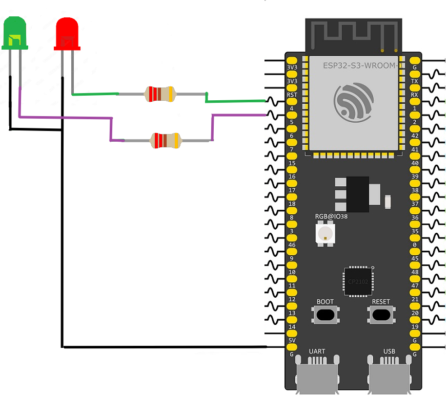

# FreeRTOS Multi-Task LED Blinking

This example demonstrates how to create and run multiple tasks on an ESP32-S3 using the FreeRTOS real-time operating system. Two independent tasks are created, with each task responsible for controlling a separate LED. This approach allows both LEDs to blink at different frequencies simultaneously without blocking one another.

The project creates two FreeRTOS tasks, each configured to blink a different LED. The first task toggles an LED connected to GPIO 4 every 500 milliseconds, while the second task toggles an LED connected to GPIO 5 every 1000 milliseconds. Instead of using a blocking delay function, each task calls `vTaskDelay()`, which places the task into the **Blocked** state for the specified duration. During this time, the scheduler automatically switches execution to other ready tasks, allowing both LEDs to blink independently.

Both tasks are created inside `app_main()` using `xTaskCreatePinnedToCore()`. Each task is assigned a dedicated task function, a stack size of 2048 bytes, a priority of 1, and is pinned to Core 1. Once created, the FreeRTOS scheduler manages task execution, automatically switching between tasks whenever one enters the Blocked state.

