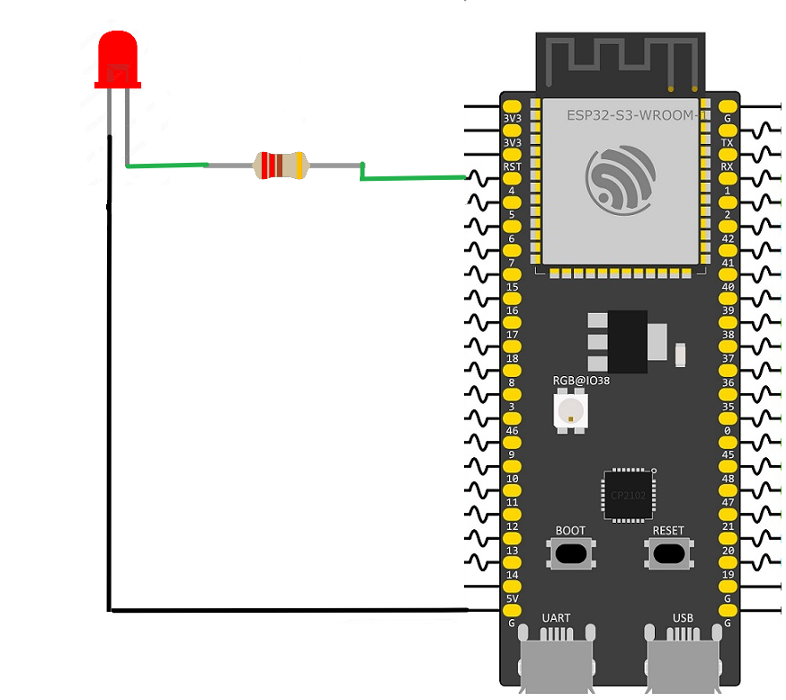

# FreeRTOS Task Management:

This example demonstrates how to manage the lifecycle of FreeRTOS tasks on an ESP32-S3 using ESP-IDF. In addition to creating tasks, FreeRTOS provides functions that allow an application to temporarily pause, resume, or permanently remove tasks during runtime.

To control a task after it has been created, the application must store its **Task Handle**. A task handle is a unique reference returned when the task is created, allowing the application to identify and manage that specific task throughout its lifetime.

The project begins by creating a task with `xTaskCreatePinnedToCore()` and storing its handle in a `TaskHandle_t` variable. Once the task has been created, the application demonstrates three common task management operations. Calling `vTaskSuspend()` moves the task into the **Suspended** state, preventing it from executing until it is explicitly resumed. The task remains suspended regardless of scheduler activity or timing events. Calling `vTaskResume()` returns the suspended task to the **Ready** state, allowing the scheduler to execute it again when appropriate. Finally, calling `vTaskDelete()` permanently removes the task from the system, releasing its allocated stack memory and all associated resources. If the application needs to execute the task again, it must create a new instance using `xTaskCreatePinnedToCore()`.

