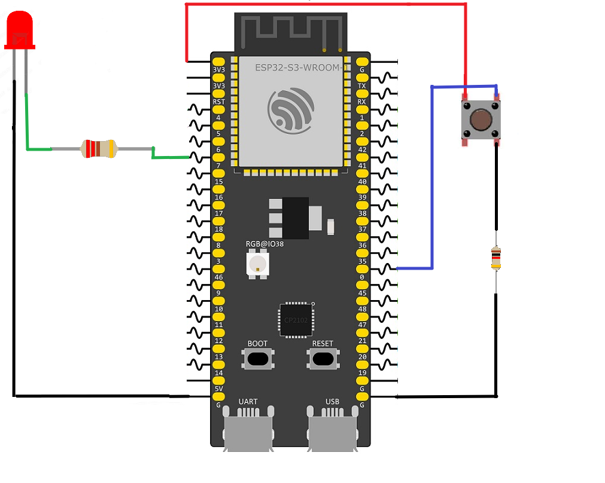

# FreeRTOS Signaling and Synchronization Using Binary Semaphores

This example demonstrates how to synchronize an **Interrupt Service Routine (ISR)** with a FreeRTOS task on an ESP32-S3 using a **Binary Semaphore**. The application is organized into separate software components, with one component responsible for handling a push-button interrupt and another responsible for controlling an LED. Rather than performing work directly inside the interrupt, the ISR simply signals a waiting task, allowing the time-consuming processing to occur outside the interrupt context.

The project begins by creating a global binary semaphore using `xSemaphoreCreateBinary()`. This semaphore serves as the communication mechanism between the button interrupt and the LED task. After verifying that the semaphore was successfully created, the application initializes the button interrupt and creates the LED task.

The **Button Component** is responsible for configuring the BOOT button as a GPIO input with an internal pull-up resistor and enabling GPIO interrupts. It registers an Interrupt Service Routine that executes whenever the button is pressed. Inside the ISR, `xSemaphoreGiveFromISR()` is used to safely signal the binary semaphore from interrupt context. If this operation unblocks a higher-priority task, `portYIELD_FROM_ISR()` requests an immediate context switch, allowing the awakened task to begin executing as soon as the interrupt completes.

The **LED Component** contains the `led_toggle_task()`, which configures the LED GPIO as an output and then continuously waits for the binary semaphore using `xSemaphoreTake()`. By specifying `portMAX_DELAY`, the task remains in the **Blocked** state without consuming CPU time until the ISR signals that the button has been pressed. Each time the semaphore is received, the task toggles the LED state before returning to wait for the next interrupt event.

The binary semaphore is shared between both software components through a global `SemaphoreHandle_t` variable. The button component is responsible for generating synchronization events, while the LED component reacts to those events. Because the ISR performs only the minimum amount of work required to signal the semaphore, the application follows the recommended **deferred interrupt processing** model, keeping interrupt latency low while allowing the FreeRTOS scheduler to handle the remaining processing efficiently.

