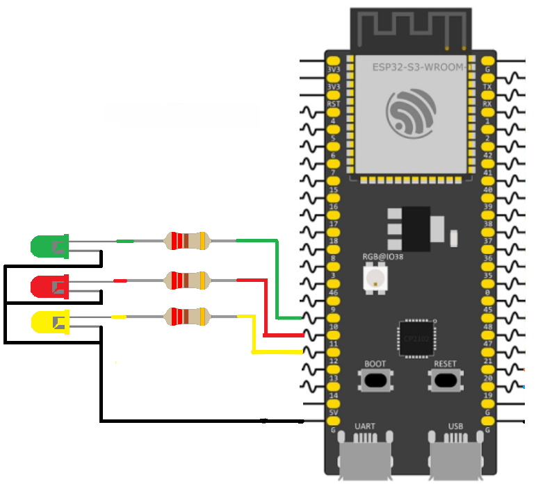

# ESP32 Web-Based LED Dashboard
This is a simple IoT project that uses an ESP32 to control hardware components through a custom web dashboard. Users can control three LEDs by sending HTTP POST requests, while the dashboard dynamically updates to reflect the real-time state of each LED.
## Features
* **Standalone Access Point:** The ESP32 broadcasts its own Wi-Fi network (AP mode), requiring no external router.
* **Embedded Web Server:** Serves HTML, CSS, and JavaScript files directly from a LittleFS partition.
* **RESTful Hardware Control:** An HTTP POST endpoint (`/led`) accepts requests to toggle specific GPIOs.
* **Dynamic Feedback:** The server responds with JSON data, allowing the frontend client to smoothly update button states and colors without reloading the page.
* **Chunked File Serving:** Efficiently serves larger web assets (like images or CSS) by breaking them into manageable chunks.
## Hardware Setup
Connect your LEDs to the following GPIO pins on the ESP32. Ensure you use appropriate current-limiting resistors (e.g., 220Ω or 330Ω) in series with each LED to prevent damage.

| Component      | Pin Assignment |
| :------------- | :------------- |
| **Green LED**  | GPIO 10        |
| **Red LED**    | GPIO 11        |
| **Yellow LED** | GPIO 12        |



## Project Architecture
The C codebase is modularized for readability and maintainability:
* `main/Example1.c`: The entry point. Initializes LittleFS, configures GPIOs, starts the Wi-Fi AP, and launches the web server.
* `components/server.c`: Configures the HTTP server and registers the URI endpoints (`/`, `/led`, `/style.css`, `/script.js`).
* `components/wifi.c`: Sets up the ESP32 as a Wi-Fi Access Point with WPA2-PSK security.
* `components/handler.c`: Contains the logic for the `/led` endpoint. It extracts the targeted LED from the POST payload, toggles it, and returns the new state as JSON.
* `components/leds.c`: Manages hardware-level GPIO configurations and state toggling for the LEDs.
* `components/static.c`: Handles file I/O, safely reading and streaming web assets from the LittleFS partition to the client.
* `components/ltfs.c`: Mounts the LittleFS storage partition so the web server can access the static files.
* `components/utils.c`: Contains a custom string parser to extract the targeted LED index from the incoming HTTP payload.

## Setting Up LittleFS
The LittleFS component must be added to the project to serve the web files. 
### 1. Add the Dependency
We create an `idf_component.yml` file inside the `main` directory with the following dependency:
```yaml
dependencies:
  joltwallet/littlefs: "~=1.21.0"
````
During the build process, the ESP-IDF Component Manager automatically downloads and integrates the `esp_littlefs` component into the project.
### 2. Configure the ESP-IDF Project
After adding the component dependency and the `partitions.csv` file, we need to configure the project by running:
```
idf.py menuconfig
```
We make two changes in the configuration menu:
1. **Partition Table:** Navigate to `Partition Table` -> `Partition Table` and change the option from **Single factory app, no OTA** to **Custom partition table CSV**.
2. **Flash Size:** Since the application now contains both the firmware and a dedicated LittleFS partition, ensure that the configured flash size matches your ESP32 module. Navigate to `Serial flasher config` -> `Flash size` and select a flash size that is large enough to accommodate both the application and all defined partitions.

### 3. Automate the File System Build
To automatically package and flash the static files, we add the following line to the project's top-level `CMakeLists.txt`:
```
littlefs_create_partition_image(storage web FLASH_IN_PROJECT)
```
This instructs ESP-IDF to generate a LittleFS image from the contents of the local directory and automatically flash it to the `storage` partition whenever `idf.py flash` is executed.
## API Reference
### Toggle LED
Changes the state of a specific LED and returns its new state.
* **URL:** `/led`
* **Method:** `POST`
* **Content-Type:** `text/plain` or `application/json`

**Request Payload:**
```json
{
  "Led": 1
}
````
Where `1` = Green, `2` = Red, `3` = Yellow

**Success Response:**
- **Code:** 200 OK
- **Content:**
```
{
  "NextState": "ON"
}
```
