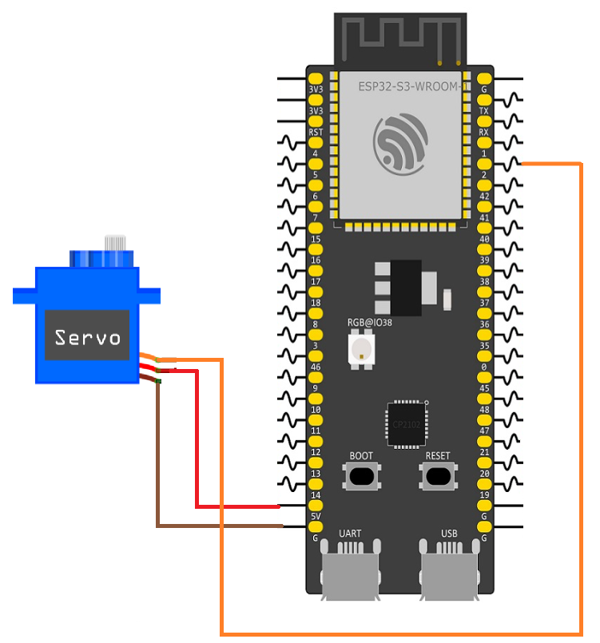

# ESP32 Web-Based Servo Motor Controller

This is a simple IoT project that uses an ESP32 to control a servo motor through a custom web dashboard. Users can adjust the servo angle by sending HTTP POST requests, while the dashboard provides an intuitive interface for selecting the desired position in real time.

## Features
- **Standalone Access Point:** The ESP32 creates its own Wi-Fi network (AP mode), allowing direct connection without an external router.
- **Embedded Web Server:** Serves the HTML, CSS, and JavaScript files directly from a LittleFS partition.
- **RESTful Hardware Control:** An HTTP POST endpoint (`/servo`) accepts requests containing the desired servo angle.
- **Real-Time Servo Control:** The server processes the requested angle and immediately updates the servo position using the ESP32's LEDC PWM peripheral.
- **JSON Communication:** The server returns a JSON response confirming that the requested command has been processed.
- **Chunked File Serving:** Static web assets are streamed from LittleFS in small chunks, reducing RAM usage while serving larger files.
## Hardware Setup
Connect the servo motor to the ESP32 as shown below. Power the servo from an appropriate external power supply if required, and connect all grounds together.

| Component        | Pin Assignment          |
| :--------------- | :---------------------- |
| **Servo Signal** | GPIO 2                  |
| **Servo VCC**    | 5V (or external supply) |
| **Servo GND**    | GND                     |

## Project Architecture
The C codebase is modularized for readability and maintainability:
- `main/Example2.c`: The application entry point. Initializes LittleFS, configures the servo driver, starts the Wi-Fi Access Point, and launches the web server.
- `components/server.c`: Configures the HTTP server and registers the URI endpoints (`/`, `/servo`, `/style.css`, `/script.js`).
- `components/wifi.c`: Configures the ESP32 as a Wi-Fi Access Point using WPA2-PSK security.
- `components/handlers.c`: Implements the `/servo` endpoint. It extracts the requested angle from the HTTP POST payload, updates the servo position, and returns a JSON confirmation.
- `components/servo.c`: Configures the ESP32 LEDC PWM peripheral and generates the PWM signal required to position the servo motor.
- `components/static.c`: Handles file operations by reading and streaming HTML, CSS, and JavaScript files from the LittleFS partition.
- `components/ltfs.c`: Mounts the LittleFS partition so the web server can access the dashboard files.
- `components/utils.c`: Provides helper functions for parsing numeric values and extracting the requested angle from incoming HTTP requests.

## Setting Up LittleFS
The LittleFS component must be added to the project to serve the web files.
### 1. Add the Dependency
Create an `idf_component.yml` file inside the `main` directory with the following dependency:
```yaml
dependencies:
  joltwallet/littlefs: "~=1.21.0"
```
During the build process, the ESP-IDF Component Manager automatically downloads and integrates the `esp_littlefs` component into the project.
### 2. Configure the ESP-IDF Project
After adding the component dependency and the `partitions.csv` file, configure the project by running:
```bash
idf.py menuconfig
```
Make the following changes:
1. **Partition Table:** Navigate to `Partition Table` → `Partition Table` and change the option from **Single factory app, no OTA** to **Custom partition table CSV**.
2. **Flash Size:** Since the project now contains both the application firmware and a LittleFS partition, ensure that the configured flash size matches your ESP32 module. Navigate to `Serial flasher config` → `Flash size` and select a size large enough for all partitions.
### 3. Automate the File System Build
Add the following line to the project's top-level `CMakeLists.txt`:
```cmake
littlefs_create_partition_image(storage web FLASH_IN_PROJECT)
```

This instructs ESP-IDF to automatically generate a LittleFS image from the contents of the `web` directory and flash it into the `storage` partition whenever `idf.py flash` is executed.
## API Reference
### Set Servo Angle
Updates the servo motor to the requested angle.
- **URL:** `/servo`
- **Method:** `POST`
- **Content-Type:** `application/json`
    

**Request Payload:**
```json
{
    "Angle": 90
}
```
Where the angle is specified in degrees. Typical servo motors support values between **0°** and **180°**.

**Success Response:**
- **Code:** `200 OK`
- **Content:**
```json
{
    "Response": "Ok"
}
```
