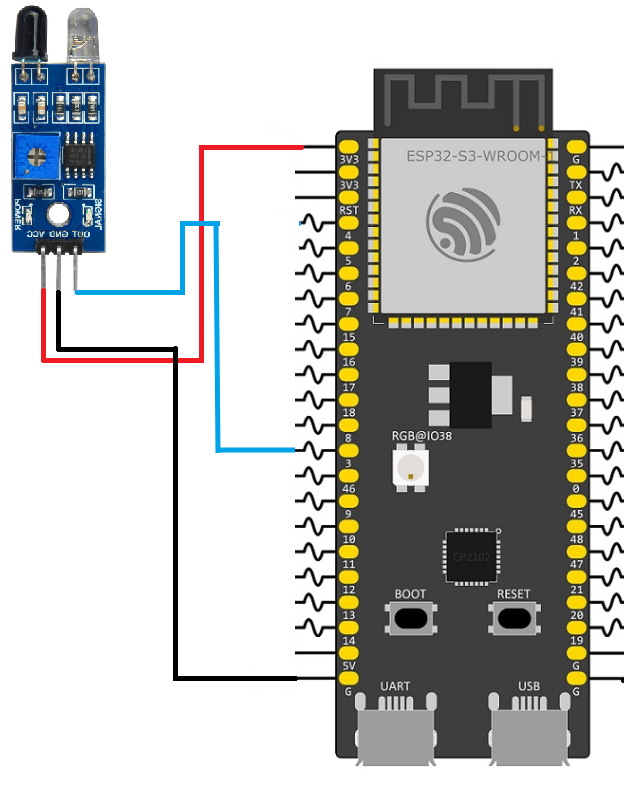

# ESP32 Real-Time Obstacle Detection
This is a simple IoT project that uses an ESP32 to monitor an obstacle sensor and display its status on a custom web dashboard in real time. Instead of repeatedly polling the ESP32 for updates, the project uses **Server-Sent Events (SSE)**, allowing the server to automatically push new sensor states to the connected browser whenever a change occurs.
## Features
- **Standalone Access Point:** The ESP32 creates its own Wi-Fi network (AP mode), allowing clients to connect directly without an external router.
- **Embedded Web Server:** Serves HTML, CSS, and JavaScript files directly from a LittleFS partition.
- **Server-Sent Events (SSE):** Maintains a persistent HTTP connection so the ESP32 can immediately notify the browser whenever the obstacle sensor changes state.
- **Interrupt-Driven Detection:** GPIO interrupts detect changes from the obstacle sensor without continuously polling the input pin.
- **FreeRTOS Synchronization:** A binary semaphore safely transfers events from the interrupt service routine to a background task responsible for sending SSE messages.
- **Chunked File Serving:** Static web assets are streamed from LittleFS in small chunks to minimize RAM usage.
## Hardware Setup
Connect the obstacle sensor to the ESP32 as shown below.

| Component                  | Pin Assignment |
| :------------------------- | :------------- |
| **Obstacle Sensor Output** | GPIO 3         |
| **VCC**                    | 3.3V           |
| **GND**                    | GND            |


## Project Architecture

The C codebase is modularized for readability and maintainability:

- `main/Example3.c`: The application entry point. Creates the synchronization semaphore, initializes LittleFS, configures the obstacle sensor, creates the SSE task, starts the Wi-Fi Access Point, and launches the web server.
- `components/server.c`: Configures the HTTP server and registers the URI endpoints (`/`, `/events`, `/style.css`, `/script.js`).
- `components/wifi.c`: Configures the ESP32 as a Wi-Fi Access Point using WPA2-PSK security.
- `components/handlers.c`: Implements the `/events` endpoint. It establishes the Server-Sent Events connection and stores the client socket information so future events can be transmitted.
- `components/obstacle.c`: Configures the GPIO interrupt for the obstacle sensor. Whenever the sensor changes state, an interrupt updates the current status and releases a semaphore.
- `components/sse_component.c`: Runs as a FreeRTOS task that waits for semaphore notifications and pushes obstacle status updates to the connected browser using Server-Sent Events.
- `components/semaphores.c`: Stores the binary semaphore shared between the interrupt service routine and the background task.
- `components/static.c`: Handles reading and streaming HTML, CSS, and JavaScript files from the LittleFS partition.
- `components/ltfs.c`: Mounts the LittleFS partition so the web server can access the dashboard files.

## How Server-Sent Events Work
Unlike a traditional web application where the browser repeatedly asks the server for updates, Server-Sent Events keep a single HTTP connection open so the server can send new data whenever it becomes available.
### Backend (ESP32)
When the browser requests the `/events` endpoint, the ESP32 responds with the special HTTP headers required for an SSE connection.
```
HTTP/1.1 200 OK
Content-Type: text/event-stream
Cache-Control: no-store
```
After sending these headers, the HTTP connection remains open instead of closing.  
The server stores the client's socket information so it can continue writing data through the same connection later.  

Example
```C
httpd_socket_send(mySocketHD, mySocketFD, "data: Information\n\n", strlen("data: Information\n\n), 0);
```
When the obstacle sensor detects a change:
1. The GPIO interrupt executes immediately.
2. The interrupt updates the current sensor state.
3. The interrupt releases a binary semaphore.
4. The FreeRTOS task waiting on that semaphore wakes up.
5. The task sends a new SSE message through the already-open socket.


For example:
```text
data: Obstacle
```
or
```text
data: No obstacle
```
Every message begins with `data:` followed by the message then two newline characters, which tells the browser that a complete event has been received.
### Frontend (Browser)
The browser creates an `EventSource` object:
```javascript
const events = new EventSource("/events");
```
Unlike `fetch()`, this request never finishes. The browser simply waits for incoming events.

Whenever the ESP32 sends:
```text
data: Obstacle
```
or
```text
data: No obstacle
```
the browser immediately receives the new message through the `message` event and updates the dashboard without refreshing the page.
```js
events.onmessage = (event) => {

console.log(event.data);

};
```
Because the connection remains open, there is no need to continuously send additional HTTP requests.

## Why Use SSE Instead of Polling?
A common way to update a web dashboard is polling, With polling, the browser repeatedly sends HTTP requests every few hundred milliseconds:
```
Browser
    │
GET /status
    │
ESP32
    │
Response
    │
(wait)
    │
GET /status
    │
Response
```
Even when nothing has changed, the browser continues generating network traffic.

This approach has several disadvantages:
- Unnecessary HTTP requests increase CPU usage.
- Additional Wi-Fi traffic wastes bandwidth.
- Sensor changes are only detected at the next polling interval.
- Smaller polling intervals improve responsiveness but further increase network load.
    

Server-Sent Events work differently, the browser establishes a single HTTP connection:
```
Browser
      │
GET /events
      │
──────────── Connection Stays Open ────────────
      │
ESP32 sends data only when needed
      │
Browser immediately updates the dashboard
```
Instead of the browser repeatedly asking for updates, the ESP32 only sends information when the obstacle sensor changes state.

This provides several advantages:
- Only one HTTP connection is created.
- No unnecessary network requests.
- Lower CPU utilization.
- Lower Wi-Fi bandwidth usage.
- Immediate updates whenever the sensor changes.
- Simpler implementation than WebSockets for one-way communication.


For applications where the browser only needs to receive data from the ESP32, Server-Sent Events provide an efficient and lightweight solution.
## Setting Up LittleFS
The LittleFS component must be added to the project to serve the web files.
### 1. Add the Dependency
Create an `idf_component.yml` file inside the `main` directory with the following dependency:

```yaml
dependencies:
  joltwallet/littlefs: "~=1.21.0"
```
During the build process, the ESP-IDF Component Manager automatically downloads and integrates the `esp_littlefs` component into the project.
### 2. Configure the ESP-IDF Project
After adding the component dependency and the `partitions.csv` file, configure the project by running:
```bash
idf.py menuconfig
```
Make the following changes:

1. **Partition Table:** Navigate to **Partition Table** → **Partition Table** and change the option from **Single factory app, no OTA** to **Custom partition table CSV**.
2. **Flash Size:** Since the project now contains both the application firmware and a LittleFS partition, ensure that the configured flash size matches your ESP32 module.
### 3. Automate the File System Build
Add the following line to the project's top-level `CMakeLists.txt`:
```cmake
littlefs_create_partition_image(storage web FLASH_IN_PROJECT)
```

This instructs ESP-IDF to generate a LittleFS image from the contents of the `web` directory and automatically flash it into the `storage` partition whenever `idf.py flash` is executed.
