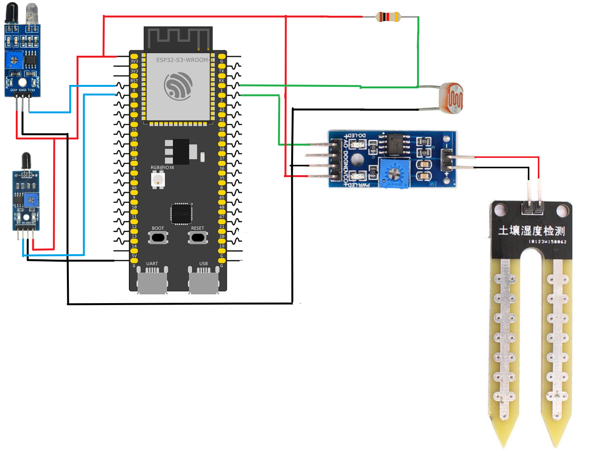

# ESP32 Multi-Sensor IoT Monitoring System 
This is a complete IoT project that uses an ESP32 to monitor multiple environmental sensors and display their readings on a custom web dashboard in real time. The system combines analog and digital sensors with FreeRTOS tasks, interrupt-driven event detection, and Server-Sent Events (SSE) to efficiently deliver live sensor updates to every connected client.

Unlike traditional polling-based dashboards, the browser establishes a single persistent connection to the ESP32. Whenever a sensor value changes or a new measurement becomes available, the ESP32 immediately pushes the updated information to all connected clients without requiring additional HTTP requests.
# Features
- **Standalone Access Point:** The ESP32 creates its own Wi-Fi network (AP mode), allowing clients to connect directly without an external router.
- **Embedded Web Server:** HTML, CSS, and JavaScript files are served directly from a LittleFS partition.
- **Real-Time Dashboard:** Sensor values are automatically pushed to the browser using Server-Sent Events (SSE).
- **Multi-Sensor Monitoring:** Simultaneously monitors obstacle, flame, light, and soil moisture sensors.
- **Interrupt-Driven Digital Sensors:** Obstacle and flame sensors use GPIO interrupts for immediate event detection.
- **ADC-Based Analog Sensors:** Light and moisture sensors are periodically sampled using the ESP32 ADC One-Shot driver.
- **Multi-Client Support:** Multiple browsers can connect simultaneously and receive the same real-time updates.
- **FreeRTOS Task Architecture:** Each sensor operates independently inside its own FreeRTOS task.
- **Thread-Safe SSE Session Management:** A mutex protects the shared client list while connections are added or removed.
- **Chunked File Serving:** Static web assets are streamed from LittleFS in small chunks to minimize RAM usage.
# Hardware Setup
Connect the sensors to the ESP32 as shown below.

| Component              | Pin Assignment |
| :--------------------- | :------------- |
| **Obstacle Sensor**    | GPIO 4         |
| **Flame Sensor**       | GPIO 5         |
| **Light Sensor (LDR)** | ADC1 Channel 0 |
| **Moisture Sensor**    | ADC1 Channel 1 |


# System Architecture
This project is organized as a collection of independent software components, where each module is responsible for a single task.

```text
                           Browser
                               │
                               │
                      HTTP + Server Sent Events
                               │
                    ┌──────────┴──────────┐
                    │     HTTP Server     │
                    └──────────┬──────────┘
                               │
                      SSE Session Manager
                               │
          ┌────────────┬────────────┬────────────┬
          │            │            │            │
   Obstacle Task  Flame Task  Light Task  Moisture Task
          │            │            │            │
      GPIO ISR     GPIO ISR      ADC Read     ADC Read
          │            │            │            │
          └────────────┴────────────┴────────────┘
                               │
                         ESP32 Hardware
```
Each sensor runs independently inside its own FreeRTOS task. Whenever new data becomes available, the task sends an SSE message to the session manager, which broadcasts the update to every connected browser.

Because each subsystem operates independently, adding new sensors only requires creating another task that generates SSE events.
# Project Architecture
The C codebase is modularized for readability and maintainability.
- `main/Example4.c` – Application entry point. Initializes queues, mutexes, LittleFS, Wi-Fi, ADC configuration, starts the HTTP server, and creates all FreeRTOS tasks.
- `components/config.c` – Configures the ADC One-Shot driver and initializes GPIO interrupts for the digital sensors.
- `components/server.c` – Configures the HTTP server and registers the URI endpoints (`/`, `/events`, `/style.css`, `/script.js`).
- `components/handlers.c` – Implements the `/events` endpoint. Establishes the Server-Sent Events connection, registers new clients, and sends the initial synchronization message.
- `components/wifi.c` – Configures the ESP32 as a Wi-Fi Access Point using WPA2-PSK security.
- `components/obstacle.c` – Handles obstacle sensor interrupts and publishes obstacle detection events.
- `components/fire_sensor.c` – Handles flame sensor interrupts and publishes flame detection events.
- `components/light_sensor.c` – Periodically samples the light sensor using the ADC One-Shot driver and sends the measured value through SSE.
- `components/moisture_sensor.c` – Periodically samples the soil moisture sensor and publishes new readings through SSE.
- `components/sse_handler.c` – Manages all connected SSE clients, broadcasts sensor updates, removes disconnected clients, and synchronizes shared resources using a mutex.
- `components/static.c` – Reads and streams HTML, CSS, and JavaScript files from the LittleFS partition.
- `components/ltfs.c` – Mounts the LittleFS partition used by the web dashboard.
# How Server-Sent Events (SSE) Work

## Backend (ESP32)
When the browser requests the `/events` endpoint, the ESP32 does **not** return a normal HTTP response.

Instead, it responds with special headers:
```http
HTTP/1.1 200 OK
Content-Type: text/event-stream
Cache-Control: no-store
```
These headers tell the browser that this is a **continuous event stream** instead of a normal web page.

Unlike a regular HTTP request, the ESP32 **keeps the socket open** after sending the headers.

The server stores the socket information for every connected client inside the SSE session manager.

Whenever a sensor task produces new data, it simply calls:
```c
send_sse_message(...)
```
The session manager loops through every active client and sends the same event to each browser.

For example:
```text
event: Light Sensor
data: 2356
```
or
```text
event: Flame Sensor
data: Flame Detected
```
Since the connection is already open, no new HTTP request is required.
## Frontend (Browser)
The dashboard creates an `EventSource` object:

```javascript
const events = new EventSource("/events");
```
To handle different sensor updates independently, the frontend registers a separate listener for each event using:

```js
events.addEventListener("Event_Name", callback);
```

Each listener is associated with a specific event name. On the server side, every SSE message includes an `event` field that identifies the type of update being sent.

For example:
```
event: Light Sensor
data: 2356
```
or
```
event: Flame Sensor
data: Flame Detected
```
When the browser receives an SSE message, it checks the value of the `event` field. If a matching event listener has been registered with `addEventListener()`, the corresponding callback function is executed.

This allows each sensor to have its own dedicated event handler, making the frontend easier to organize and preventing the logic for different sensors from interfering with one another.
# Why Use SSE Instead of Polling?

A common solution for web dashboards is polling.

With polling, the browser repeatedly sends HTTP requests:

```text
GET /status
(wait)
GET /status
(wait)
GET /status
(wait)
GET /status
```

Even if **none of the sensors have changed**, the ESP32 still has to:
- Accept the request
- Parse the request
- Generate a response
- Send the response
- Close the connection

This process repeats continuously.

As the number of connected users grows, the ESP32 wastes more CPU time processing unnecessary requests.

With Server-Sent Events:
```text
Browser
      │
GET /events
      │
──────────── Persistent Connection ────────────
      │
ESP32 pushes updates only when necessary
```
The browser opens **one connection** and keeps it alive.

Whenever any sensor generates new data, the ESP32 immediately pushes the update through that existing connection.

No repeated HTTP requests are necessary.

This approach provides several advantages:
- Significantly lower CPU usage.
- Lower Wi-Fi bandwidth consumption.
- Immediate dashboard updates.
- Lower communication latency.
- Simpler than WebSockets when communication is only required from server to client.
- Scales efficiently to multiple dashboard clients.

For monitoring applications, SSE is generally a much better choice than repeatedly sending HTTP GET or POST requests.
# Sensor Processing Architecture
Each sensor follows the same general workflow.

## Digital Sensors
Obstacle and flame sensors are interrupt driven.
```text
GPIO Interrupt
      │
      ▼
Interrupt Service Routine (ISR)
      │
      ▼
FreeRTOS Queue
      │
      ▼
Sensor Task
      │
      ▼
send_sse_message()
      │
      ▼
Browser Dashboard
```
Using interrupts allows the ESP32 to react immediately without continuously checking the GPIO pins.
## Analog Sensors
Light and moisture sensors are sampled periodically.
```text
ADC One-Shot Driver
        │
        ▼
Sensor Task
        │
        ▼
Read ADC Value
        │
        ▼
Format SSE Message
        │
        ▼
Browser Dashboard
```
Each analog sensor task performs a measurement every second before broadcasting the new value.
# Setting Up LittleFS
The LittleFS component must be added to the project to serve the web files.
## 1. Add the Dependency
Create an `idf_component.yml` file inside the `main` directory:
```yaml
dependencies:
  joltwallet/littlefs: "~=1.21.0"
```

During the build process, the ESP-IDF Component Manager automatically downloads and integrates the LittleFS component into the project.

## 2. Configure the ESP-IDF Project

Run:
```bash
idf.py menuconfig
```
Make the following changes:
1. Change the partition table to **Custom partition table CSV**.
    
2. Configure the flash size to match your ESP32 module and ensure enough space exists for both the application and the LittleFS partition.
## 3. Automate the File System Build

Add the following line to the project's top-level `CMakeLists.txt`:

```cmake
littlefs_create_partition_image(storage web FLASH_IN_PROJECT)
```

ESP-IDF will automatically package the contents of the `web` directory into a LittleFS image and flash it together with the firmware.
# Server-Sent Events Endpoint
## Receive Real-Time Sensor Updates
Creates a persistent HTTP connection that continuously delivers sensor updates.

- **URL:** `/events`
- **Method:** `GET`
- **Response Type:** `text/event-stream`
### Example Events

```text
event: Obstacle Sensor
data: Obstacle Detected
```

```text
event: Flame Sensor
data: Flame Detected
```

```text
event: Light Sensor
data: 2375
```

```text
event: Moisture Sensor
data: 1812
```

The connection remains open for the lifetime of the dashboard, allowing the ESP32 to immediately broadcast new sensor readings to every connected browser.
