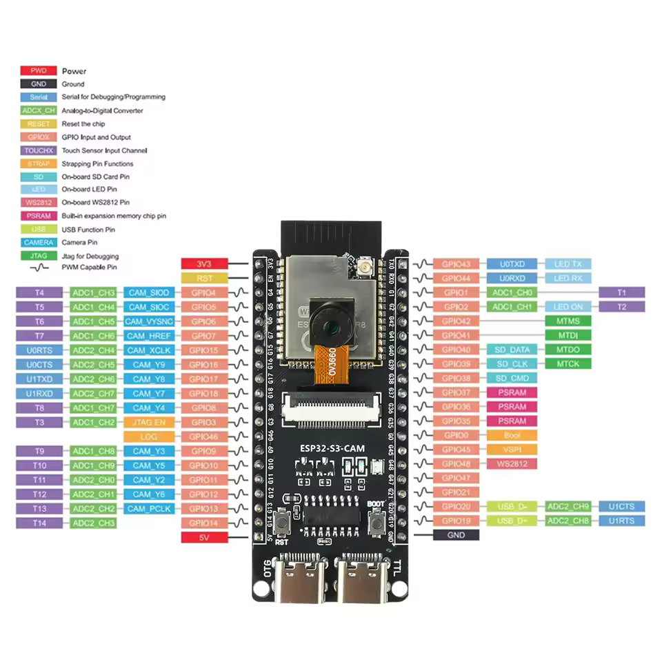

# ESP32-S3 Camera Live Streaming Server

This project demonstrates how to build a simple wireless camera streaming system using the ESP32-S3 and the ESP32 Camera Driver. The ESP32 operates as a Wi-Fi Access Point, hosts a custom web dashboard stored on LittleFS, and continuously streams live JPEG images from the camera to any connected browser using an MJPEG HTTP stream.

Unlike capturing a single image, this project keeps an HTTP connection open and continuously sends JPEG frames, allowing the browser to display a smooth live video feed without refreshing the page.
# Features
- **Standalone Access Point:** The ESP32-S3 creates its own Wi-Fi network (AP mode) with WPA2-PSK security, allowing up to 4 clients to connect directly.
- **Live MJPEG Streaming:** Video is pushed to the browser continuously using a `multipart/x-mixed-replace` HTTP response.
- **Embedded Web Server:** HTML, CSS, and JavaScript files are served directly from a LittleFS partition.
- **High-Speed PSRAM Utilization:** Uses Octal SPI PSRAM to handle demanding camera frame buffers smoothly.
- **Modular Architecture:** Camera initialization, Wi-Fi networking, LittleFS mounting, and HTTP request handling are strictly separated into independent C modules.
- **Chunked File Serving:** Static web assets are read and transmitted in small 255-byte chunks to minimize RAM usage during file transfers.
- **Automatic Image Adjustments:** The camera output is horizontally mirrored and vertically flipped by default to account for standard module mounting orientations.

# Hardware Setup
The camera module is connected to  ESP32-S3.  As following

| ESP32-S3 Pin Label | Code Definition (`camera.h`) | GPIO Pin |
| ------------------ | ---------------------------- | -------- |
| **CAM_XCLK**       | `CAM_PIN_XCLK`               | GPIO 15  |
| **CAM_SIOD**       | `CAM_PIN_SIOD`               | GPIO 4   |
| **CAM_SIOC**       | `CAM_PIN_SIOC`               | GPIO 5   |
| **CAM_Y9**         | `CAM_PIN_D7`                 | GPIO 16  |
| **CAM_Y8**         | `CAM_PIN_D6`                 | GPIO 17  |
| **CAM_Y7**         | `CAM_PIN_D5`                 | GPIO 18  |
| **CAM_Y6**         | `CAM_PIN_D4`                 | GPIO 12  |
| **CAM_Y5**         | `CAM_PIN_D3`                 | GPIO 10  |
| **CAM_Y4**         | `CAM_PIN_D2`                 | GPIO 8   |
| **CAM_Y3**         | `CAM_PIN_D1`                 | GPIO 9   |
| **CAM_Y2**         | `CAM_PIN_D0`                 | GPIO 11  |
| **CAM_VYSNC**      | `CAM_PIN_VSYNC`              | GPIO 6   |
| **CAM_HREF**       | `CAM_PIN_HREF`               | GPIO 7   |
| **CAM_PCLK**       | `CAM_PIN_PCLK`               | GPIO 13  |

Notice that the data pins in the code (`D0`-`D7`) correspond to the hardware camera pins labeled as `Y2`-`Y9` on the ESP32-S3 diagram.




The GPIO definitions inside `camera.h` must exactly match the physical wiring between the ESP32-S3 and the camera module. Incorrect pin assignments will prevent the camera from initializing.
# Project Architecture
- `main/Example5.c` – The application entry point. Coordinates the initialization of LittleFS, the camera, the Wi-Fi AP, and the HTTP server.
- `components/camera.h` & `camera.c` – Maps the GPIO pins to the camera interface and configures the `esp_camera` driver (VGA resolution, JPEG format, quality settings). Also applies orientation adjustments.
    
- `components/wifi.c` – Configures the ESP32-S3 as a standalone Wi-Fi Access Point, managing network interfaces and event loops.
    
- `components/ltfs.c` – Initializes and mounts the LittleFS partition to the `/web` virtual path so the HTTP server can access static UI files.
    
- `components/server.c` – Configures the web server and registers all URI endpoints (`/`, `/style.css`, `/script.js`, `/stream`).
    
- `components/static.c` – Handles regular HTTP requests. Opens files from LittleFS and safely streams them to the client in 255-byte chunks.
    
- `components/camera_stream.c` – Implements the `/stream` endpoint. Manages the infinite loop that captures frames, formats the HTTP multipart boundary headers, and sends the raw JPEG buffers to the browser.

# Project Configuration
To build and run this project successfully, you must configure the ESP-IDF environment to include the required dependencies and enable external memory (PSRAM), which is critical for handling camera frame buffers.

## 1. Add the Camera Dependency
You must add the official ESP32 camera driver alongside with LittleFS to your project. Create or modify the `idf_component.yml` file inside your `main` directory:
```
dependencies:
  espressif/esp32-camera: "*"
  joltwallet/littlefs: "~=1.21.0"
```

During the build process, the ESP-IDF Component Manager will automatically download and integrate the driver.

## 2. Enable PSRAM Configuration
Because image processing requires significant memory, you must enable PSRAM and configure it to match the ESP32-S3's high-speed octal mode.

Run the configuration menu:

```
idf.py menuconfig
```

Navigate through the menus and apply the following settings:
1. Go to **Component config**
2. Select **ESP PSRAM**
3. Check **Support for external, SPI connected RAM**
4. Go to **SPI RAM config**
5. Select **Mode of SPI RAM chip in use**
6. Choose **Octal Mode PSRAM**
## 3. Configure the Partition Table
Before building the project, configure ESP-IDF to use your custom partition table.
Run:
```bash
idf.py menuconfig
```
Then navigate to:

```
Partition Table
    → Partition Table
        → Custom partition table CSV
```
This tells ESP-IDF to use the custom `partitions.csv` file included in the project instead of the default partition layout.
## 4. Automate the File System Build
Add the following line to the project's top-level `CMakeLists.txt`:

```cmake
littlefs_create_partition_image(storage web FLASH_IN_PROJECT)
```

ESP-IDF will automatically package the contents of the `web` directory into a LittleFS image and flash it together with the firmware.
# Camera Configuration
The camera is configured using the `camera_config_t` structure before calling `esp_camera_init()`.

This example uses:
- **Pixel Format:** JPEG
- **Frame Size:** VGA (640×480)
- **JPEG Quality:** 20
- **Frame Buffers:** 1
- **Grab Mode:** Latest Frame

After initialization, the image is vertically flipped and mirrored to match the physical camera orientation.

# How MJPEG Streaming Works
When the browser's `` tag or video container requests the `/stream` endpoint, it expects an image. However, the ESP32 does not close the connection after sending one picture.

Instead, it sends a continuous response using a special content type:
```
Content-Type: multipart/x-mixed-replace;boundary=123456789000000000000987654321
```
This tells the browser: "I am going to send you multiple parts. Every time you see the boundary string, replace the previous image with the new one."

Inside `camera_stream.c`, the ESP32 enters a `while(true)` loop:
1. **Capture:** Grabs the latest frame buffer (`esp_camera_fb_get`).
2. **Convert:** Checks if the frame is already a JPEG. If not, it converts it (`frame2jpg`).
3. **Header:** Sends the `_STREAM_BOUNDARY` string followed by the exact length of the new image.
4. **Payload:** Streams the raw JPEG binary data (`jpg_buf`).
5. **Cleanup:** Returns the frame buffer to the camera driver to free memory, delays briefly (`vTaskDelay`), and repeats the cycle.


Because the connection remains open and the browser constantly replaces the image on the screen as fast as the ESP32 sends boundaries, it creates a seamless live video feed.

# Web Server Endpoints

| Endpoint | Method | Description |
| :-------- | :----: | :---------- |
| `/` | GET | Serves the dashboard. |
| `/style.css` | GET | Serves the stylesheet. |
| `/script.js` | GET | Serves the JavaScript file. |
| `/stream` | GET | Streams live MJPEG video from the camera. |

# Camera Streaming Workflow

```text
Browser
    │
GET /stream
    │
HTTP Server
    │
Capture Frame
    │
JPEG Image
    │
Send HTTP Chunk
    │
Repeat
```

The connection remains open while the browser is connected, allowing the ESP32 to continuously transmit live camera frames.
